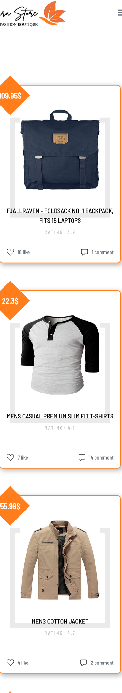
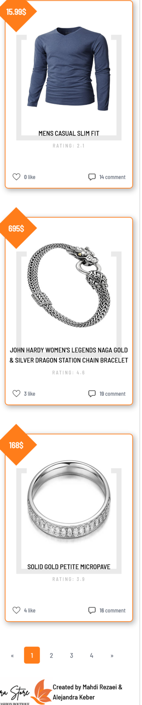

# JS-capstone
## Table of contents

- [Overview](#overview)
  - [The challenge](#the-challenge)
  - [Screenshot](#screenshot)
  - [Links](#links)
- [Project Setup](#Setup-Project)
  - [commands](#command)
- [My process](#my-process)
  - [Built with](#built-with)
  - [What I learned](#what-i-learned)
  - [Continued development](#continued-development)
  - [Useful resources](#useful-resources)
- [Author](#author)
- [Acknowledgments](#acknowledgments)

## Overview
This project is the capstone for module two of Microverse Bootcamp and has been done as a team and covered the following topics:
- Connections to external APIs
- Testing program functionalities using Jest
- Displaying some products in to the UI
- Added like and Comment features to the App
- Added popup window with more data about an item that you can use to comment the products and also see a list of comments
- Displaying the number of likes and comments for each product

[](https://drive.google.com/file/d/11owDO3X9f6KLiSCzN1Y80Nqj6BzqEE0C/view?usp=sharing)
### Screenshot

| Desktop version                              |               Mobile Version                |               Mobile Version                |
| -------------------------------------------- | :-----------------------------------------: |  ----------------------------------------- |
|  |  | |

## Live Demo
[MahdiSohaily.github.io/JS-capstone/](MahdiSohaily.github.io/JS-capstone/)
### Prerequisites

For this project you must have node.js installed.

### Setup Project

In order to run this project locally in your machine follow the following steps:
```
git clone https://github.com/MahdiSohaily/JS-capstone.git
cd Todo-app
npm install
npm run dev
npm run start
```

## My process
## Built With
- HTML5 
- CSS3
- Purge CSS
- Flexbox
- CSS Grid
- Mobile-first workflow
- Webpack 5
- JavaScript
- Axios
- Jest for testing

### Author

👤 **Mahdi Rezaei**

- Frontend Mentor - [@MahdiSohaily](https://www.frontendmentor.io/profile/MahdiSohaily)
- Twitter - [@Mahdi_Rezaei_AF](https://twitter.com/Mahdi_Rezaei_AF)
- linkedIn - [@Mahdi-rezaei](https://www.linkedin.com/in/mahdi-rezaei-74705713b)

👤 **Alejandra Keber Maggi**

- GitHub: [@AlejandraKeber](https://github.com/AlejandraKeber)
- Twitter: @KeberAlejandra
- LinkedIn: [alejandra-keber](www.linkedin.com/in/alejandra-keber)

## 🤝 Contributing

Contributions, issues, and feature requests are welcome!

Feel free to check the [issues page](https://github.com/MahdiSohaily/JS-capstone/issues).

## Show your support

Give a ⭐️ if you like this project!
